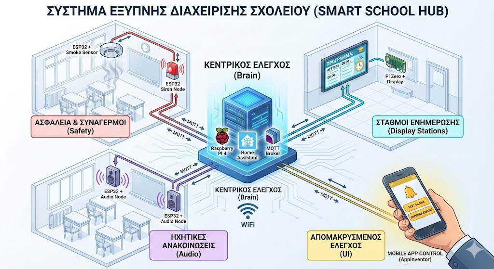

# SchoolChronos
# 🕐 Ο ΧΡΟΝΟΣ ΕΙΝΑΙ...ΤΑ ΠΑΝΤΑ....(Chronos)

## Ολοκληρωμένο Έξυπνο Οικοσύστημα Ασφάλειας, Σχολικής Διαχείρισης και Παιδαγωγικής Καινοτομίας
**Ομάδα:** SchoolChronos_Team -Μαθητές Γυμνασίου Ακραιφνίου
**Σχολείο:** Γυμνάσιο & Λ.Τ Ακραιφνίου
**Διαγωνισμός:** 8ος Πανελλήνιος Διαγωνισμός Ανοιχτών Τεχνολογιών στην Εκπαίδευση 
**Σχολική Χρονιά:** 2025-2026 
**Θεματική Ενότητα:** Ασφάλεια, Διοικητική Οργάνωση, Smart School & Παιδαγωγική Καινοτομία
Παρακάτω περιγράφεται η πρόταση έργου για την συμμετοχή της ομάδας μας , "SchoolChronos_Team", στον «8 ο Πανελλήνιο Διαγωνισμό Ανοιχτών Τεχνολογιών στην Εκπαίδευση»> 


# Α. Γενική Περιγραφή της ιδέας 

Στο έργο αυτό προτείνουμε την κατασκευή ενός Ολοκληρωμένου Έξυπνου Οικοσύστηματος Ασφάλειας, Σχολικής Διαχείρισης και Παιδαγωγικής Καινοτομίας 

Το **"Χρόνος"** προτε μια διαφορετική οπτική του τρόπου που αντιλαμβανόμαστε την ασφάλεια, τη διαχείριση και την παιδαγωγική αξιοποίηση της τεχνολογίας στο σύγχρονο σχολείο. Φιλοδοξεί να μην είναι απλώς μια τεχνική πρόταση αλλά να είναι μια **ολιστική πρόταση για τη μετατροπή του σχολικού χώρου σε ένα έξυπνο, ασφαλές, διαδραστικό και παιδαγωγικά εμπλουτισμένο περιβάλλον μάθησης**.

Αξιοποιώντας αποκλειστικά ανοιχτές τεχνολογίες και τη δωρεάν εκπαιδευτική υποδομή που ήδη διαθέτει το σχολείο, δημιουργούμε ένα οικοσύστημα που συνδυάζει την πρακτική ασφάλεια με την εκπαιδευτική καινοτομία. Το σύστημά μας ενσωματώνει πολλαπλά επίπεδα λειτουργικότητας, από την πρώιμη ανίχνευση κινδύνων και την άμεση διαχείριση κρίσεων, μέχρι την παιδαγωγική αξιοποίηση της υπάρχουσας τεχνολογικής υποδομής του σχολείου.
### Το Οικοσύστημα "Χρόνος" περιλαμβάνει:

 - **Έξυπνη Κωδωνοκρουσία** 🔔 - Πλήρως αυτοματοποιημένη με ενσωμάτωση δικτυακού προγραμματισμού
 - **Ανίχνευση Κινδύνων** - Real-time παρακολούθηση με αισθητήρες  
 - **Πολυεπίπεδη Ειδοποίηση** - Audio, οθόνες, σειρήνες, μέσω χρήσης των διαδραστικών πίνακων, εφαρμογή για κινητά 
 - **Τοπικοί Σταθμοί** - Raspberry Pi Zero 2W με οθόνες σε κάθε τάξη, όπου είναι απαραίτητο
 - **Ενσωμάτωση Διαδραστικών Πινάκων** - Αξιοποίηση υπάρχουσας υποδομής
 - **Προβλεψη για Cloud Integration** -Προαιρετική ολοκλήρωση με Google Workspace για απομακρυσμένο έλεγχο 
 - **Multi-User System** - Διαβαθμισμένα δικαιώματα χρηστών 
 -  **Εκπαιδευτικό Υλικό** - Πλήρης βιβλιοθήκη διδακτικών εργαλείων 
 - **Εξοικείωση με Python** - Σύνδεση με το νέο αναλυτικό πρόγραμμα Γυμνασίου

**Φιλοσοφία:** Η τεχνολογία δεν είναι αυτοσκοπός, αλλά εργαλείο που προστατεύει, εκπαιδεύει, εμπνέει και μετασχηματίζει τη σχολική κοινότητα.

Το σύστημά μας θα υλοποιηθεί  αποκλειστικά με  ανοιχτό και ελεύθερο λογισμικό και υλικό , το οποίο θα μπορούμε να διαχειριστούμε τοπικά καθώς και από το διαδίκτυο.

Συνεπώς το σύστημά μας δεν θα είναι δεσμευμένο και εξαρτώμενο από εξωτερικές υπηρεσίες (πλην των προαιρετικών) καθώς επίσης θα είναι  πλήρως επεκτάσιμο.

<!---->





>  *<font size="3"> Σημείωση : Οι παραπάνω εικόνες έχουν παραχθεί με  τεχνητή νοημοσύνη , <br> και  προσπαθούν να απεικονίζουν σφαιρικά  και όχι με ιδιαίτερες λεπτομέρειες την κεντρική ιδέα του προτεινόμενου έργου  (δίνεται έμφαση στο αποτέλεσμα και την περιγραφή του ) .  <br>Προφανώς τεχνικά δεν είναι ακριβής και δεν αποτελούν   την απεικόνιση του τελικού παραδοτέου έργου </font>*
---

# Τι παρόμοιο υπάρχει - Τρέχουσα αντιμετώπιση προβλήματος

Στην προσπάθειά μας να ερευνήσουμε την τρέχουσα κατάσταση και να παρατηρήσουμε τι λύσεις υπάρχουν σε παρόμοια προβλήματα καταλήξαμε στις παρακάτω διαπιστώσεις:

Η αγορά διαθέτει **μεμονωμένες λύσεις** για επιμέρους πτυχές του προβλήματος που αντιμετωπίζουμε, αλλά όχι μια ολοκληρωμένη, προσιτή και εκπαιδευτικά προσανατολισμένη προσέγγιση. Τα παραδοσιακά **συστήματα πυρανίχνευσης** για σχολεία είναι επαγγελματικές λύσεις υψηλού κόστους που χρησιμοποιούν "εταιρική" τεχνολογία, απαιτούν συμβάσεις συντήρησης με συγκεκριμένους προμηθευτές, και λειτουργούν ως αυτόνομα, μη διασυνδεδέμενα συστήματα χωρίς ενσωμάτωση με άλλες σχολικές λειτουργίες. Το κρίσιμο όμως είναι ότι **δεν προσφέρουν καμία παιδαγωγική αξία**—οι μαθητές δεν εμπλέκονται, δεν μαθαίνουν πώς λειτουργούν, και δεν συμμετέχουν στην ανάπτυξη ή συντήρησή τους.​

Τα **αυτοματοποιημένα συστήματα κωδωνοκρουσίας** που υπάρχουν είναι συνήθως συσκευές με χρονοδιακόπτες που απαιτούν χειροκίνητο προγραμματισμό επιτόπου και δεν προσφέρουν δικτυακή διαχείριση, ή πολυμεσικές δυνατότητες όπως μουσική διαλειμμάτων και φωνητικές ανακοινώσεις. Στον χώρο των **Smart School IoT solutions**, υπάρχουν τεχνολογικά προηγμένες πλατφόρμες με real-time παρακολούθηση και analytics, αλλά αυτές στοχεύουν σε μεγάλα εκπαιδευτικά ιδρύματα με πολούς οικονομικούς πόρους, είναι εμπορικές λύσεις χωρίς πρόσβαση στον πηγαίο κώδικα, και δεν έχουν εκπαιδευτική διάσταση.​

---
# Αναγκαιότητα του Έργου - Στόχοι

Σύμφωνα με την ανάλυση των δεδομένων που παρουσιάστηκαν στην προηγούμενη παράγραφο, προέκυψε η ιδέα και η πρόταση για το παρόν σύστημα.

Πιο συγκεκριμένα το σύστημα που προτείνουμε έχει τα παρακάτω χαρακτηριστικά τα οποία προσπαθούν να λύσουν τα προβλήματα που προέκυψαν κατά την έρευνά μας. Τα προτεινόμενα και επιθυμητά χαρακτηριστικά είναι τα εξής:

 - Να ακολουθεί ανοικτά πρότυπα
 - Να είναι επεκτάσιμο 
 - Να μπορεί να διασυνδέει υπάρχοντα συστήματα
 - Να δίνει την δυνατότητα προγραμματισμού στον χρήστη
 - Να συντελεί στην δημιουργία προτύπου για πειραματισμό
 - Την δημιουργία πειραματικής υποδομής για μελλοντική χρήση τόσο στο σχολείο όσο και αλλού
 - Να αξιοποιεί τις δεξιότητες όλων των μελών της ομάδας


## Η καινοτομία του "Χρόνος":

Το σύστημά μας ξεπερνά αυτούς τους περιορισμούς με **έξι καινοτόμες διαστάσεις**:

**1. Ενοποίηση Συστημάτων:**  
Ενοποιούμε πυρανίχνευση, έξυπνο κουδούνι, σταθμούς απεικόνισης, σειρήνες, διαδραστικούς πίνακες και Cloud εφαρμογές σε ένα ενιαίο οικοσύστημα που επικοινωνεί μέσω ανοιχτών πρωτοκόλλων (MQTT, HTTP). Όλα τα υποσυστήματα συνεργάζονται αντί να λειτουργούν μεμονωμένα.​

**2. Οικονομική προσβασιμότητα:**  
Χρησιμοποιούμε οικονομικό open-source hardware και αξιοποιούμε την υπάρχουσα σχολική υποδομή (Wi-Fi, διαδραστικοί πίνακες, ...), καθιστώντας το σύστημα προσβάσιμο σε κάθε σχολείο ανεξάρτητα από το οικονομικούς πόρους.​

**3. Πλήρης ανεξαρτησία:**  
Open-source κώδικας και ανοιχτά πρωτόκολλα σημαίνουν μηδενική εξάρτηση από προμηθευτές. Το σχολείο μπορεί να επεκτείνει, τροποποιήσει και συντηρεί το σύστημα αυτόνομα.​

**4. Ζωντανό εκπαιδευτικό εργαλείο:**  
Οι μαθητές **δημιουργούν, προγραμματίζουν και συντηρούν** το σύστημα που προστατεύει το σχολείο τους. Μαθαίνουν Python, IoT, hardware integration και υπολογιστική σκέψη μέσα από ένα πραγματικό έργο με κοινωνική επίδραση. Παράγεται εκπαιδευτικό υλικό (σχέδια μαθημάτων, φύλλα εργασ'ίας, tutorials) που μπορούν να χρησιμοποιηθούν απο την εκπαιδευτική κοινότητα.​

**5. Έξυπνη αξιοποίηση πόρων:**  
Αντί να εγκαθιστούμε εντελώς νέο hardware, **μετασχηματίζουμε την υπάρχουσα τεχνολογία** του σχολείου. Οι διαδραστικοί πίνακες γίνονται σταθμοί έκτακτης ανάγκης, το Wi-Fi δίκτυο μεταφέρει τα δεδομένα ελέγχου, και οι ήδη χρησιμοποιούμενες **Υπηρεσίες cloud** διαχειρίζεται το σύστημα απομακρυσμένα​

**6. Αρθρωσιμότητα και επεκτασιμότητα:**  
Η αρθρωτή αρχιτεκτονική επιτρέπει εύκολη προσθήκη νέων λειτουργιών και αισθητήρων. Αρχίζουμε με ένα πιλοτικό σύστημα και το επεκτείνουμε σταδιακά, χωρίς να χρειαστεί αντικατάσταση της βασικής υποδομής.​

### Συμπέρασμα:

Ενώ υπάρχουν τμηματικές λύσεις για πυρασφάλεια ή αυτοματισμό κουδουνιού , **δεν υπάρχει ένα ολοκληρωμένο, open-source, οικονομικό σύστημα που να συνδυάζει ασφάλεια, αυτοματισμό και εκπαίδευση**. Το "Χρόνος" , λοιπόν, δίνει λύση και μια **"φιλοσοφία"** για το πως η **τεχνολογία μπορεί να εξυπηρετήσει τα σχολεία**, κάνοντας τα προσβάσιμα, ανεξάρτητα, εκπαιδευτικά και κοινωνικά υπεύθυνα.

# Β. Δομή - Χρήση - Υλοποίηση του Συστήματος

Το σύστημα "Χρόνος" βασίζεται σε μια **κατανεμημένη, αρθρωτή αρχιτεκτονική** που συνδυάζει κεντρικό έλεγχο με αυτόνομους τοπικούς σταθμούς. Κάθε υποσύστημα επικοινωνεί ασύρματα μέσω του σχολικού δικτύου, ενώ ο κεντρικός εξυπηρετητής συντονίζει όλες τις λειτουργίες, εκτελεί αυτοματισμούς και διαχειρίζεται τους χρήστες. Η φιλοσοφία σχεδιασμού προνοεί ότι κάθε τοπικός σταθμός μπορεί να λειτουργήσει ημιαυτόνομα ακόμα κι αν χαθεί προσωρινά η σύνδεση με τον κεντρικό εξυπηρετητή, εξασφαλίζοντας αξιοπιστία και ανθεκτικότητα σε βλάβες.​

----------

## Βασικά Μέρη του Συστήματος

<p align="center"></p>

## 1. Κεντρικός Εξυπηρετητής

Το κέντρο του συστήματος αποτελεί ένας **κεντρικός εξυπηρετητής** που υλοποιείται σε μικροϋπολογιστή (προτείνεται  **Raspberry Pi 5 kit** ) και φιλοξενεί ανοιχτό λογισμικό διαχείρισης αυτοματισμών. Ο εξυπηρετητής αυτός λειτουργεί ως εγκέφαλος του συστήματος και αναλαμβάνει πολλαπλούς ρόλους.​

**Κύριες Λειτουργίες:**

-   **Κεντρικός κόμβος επικοινωνίας:** Διαχειρίζεται τη διασύνδεση όλων των υποσυστημάτων μέσω πρωτοκόλλου μηνυμάτων (MQTT)
    
-   **Μηχανή αυτοματισμών:** Εκτελεί σύνθετα σενάρια αντίδρασης (π.χ. "αν ανιχνευθεί καπνός τότε ενεργοποίησε όλα τα συστήματα ειδοποίησης")
    
-   **Χρονοπρογραμματιστής:** Διαχειρίζεται το αυτοματοποιημένο ωράριο κωδωνοκρουσιών με βάση δεδομένα από το ηλεκτρονικό φύλλο
    
-   **Διαχείριση χρηστών:** Εφαρμόζει πολυεπίπεδη πιστοποίηση και εξουσιοδότηση χρηστών
    
-   **Διασύνδεση με υπηρεσίες διαδικτύου:** Επικοινωνεί με  Cloud πλατφόρμες για απομακρυσμένο έλεγχο
    
-   **Καταγραφή συμβάντων:** Αποθηκεύει όλα τα γεγονότα για μελλοντική ανάλυση και λογοδοσία
    

**Τεχνική Υλοποίηση:**  
Χρησιμοποιείται μικροϋπολογιστής με επαρκή υπολογιστική ισχύ, συνδεδεμένος στο σχολικό δίκτυο μέσω ενσύρματης σύνδεσης για μέγιστη αξιοπιστία. Το λειτουργικό σύστημα και το λογισμικό αυτοματισμού είναι πλήρως ανοιχτού κώδικα, επιτρέποντας στους μαθητές να μελετήσουν και να επεκτείνουν τη λειτουργικότητα.​

----------

## 2. Σταθμοί Ηχητικής Ειδοποίησης

Οι **σταθμοί ηχητικής ειδοποίησης** είναι κατανεμημένοι μικροελεγκτές (προτείνεται  **ESP32 kit** ) που τοποθετούνται στρατηγικά σε όλους τους χώρους του σχολείου—αίθουσες διδασκαλίας, διάδρομοι, αύλειο, εργαστήρια. Κάθε σταθμός είναι ένας αυτόνομος κόμβος που δέχεται εντολές από τον κεντρικό εξυπηρετητή και αναπαράγει ήχο υψηλής ποιότητας.​

**Δυνατότητες:**

-   **Κωδωνοκρουσίες:** Αναπαραγωγή προσαρμοσμένων ήχων για έναρξη/λήξη μαθημάτων, διαλείμματα
    
-   **Φωνητικές οδηγίες:** Μετάδοση προηχογραφημένων ή συνθετικών μηνυμάτων εκκένωσης ( με δυνατότητα εξειδίκευσης ανα χώρο σύμφωνα με τα σχέδια εκκένωσης )
    
-   **Μουσική διαλειμμάτων:** Αναπαραγωγή μουσικής που επιλέγεται από τη μαθητική κοινότητα
    
-   **Ανακοινώσεις:** Μετάδοση σημαντικών ανακοινώσεων από τη διεύθυνση
    
-   **Επείγουσες ειδοποιήσεις:** Άμεση εκπομπή ηχητικών συναγερμών με μέγιστη ένταση
    

**Τεχνική Υλοποίηση:**  
Κάθε σταθμός αποτελείται από μικροελεγκτή με δυνατότητα ασύρματης δικτύωσης, ψηφιακό ενισχυτή ήχου και ηχείο κατάλληλης ισχύος. Η προγραμματιστική υλοποίηση γίνεται με ανοιχτό πλαίσιο εργασίας που επιτρέπει εύκολη ενημέρωση του λογισμικού εξ αποστάσεως.​

----------

## 3. Οθόνες Οπτικής Ενημέρωσης

Οι **οθόνες οπτικής ενημέρωσης** είναι αυτόνομοι σταθμοί πληροφόρησης που τοποθετούνται σε κεντρικά σημεία (είσοδος κάθε ορόφου, αίθουσα πολλαπλών χρήσεων, βιβλιοθήκη). Παρέχουν οπτική ανατροφοδότηση σε πραγματικό χρόνο και μετατρέπονται σε κρίσιμα εργαλεία καθοδήγησης κατά τις κρίσεις​

**Λειτουργικότητα Κανονικής Κατάστασης:**

-   Ψηφιακό ρολόι και ημερολόγιο
-   Τρέχον και επόμενο μάθημα
-   Καιρικές συνθήκες
-   Ανακοινώσεις και εκδηλώσεις
-   Καλλιτεχνικό περιεχόμενο μαθητών

**Λειτουργικότητα Έκτακτης Ανάγκης:**

-   Πλήρης οθόνη με έντονο χρωματισμό (κόκκινο για πυρκαγιά, πορτοκαλί για σεισμό)
-   Εικονογράμματα και μεγάλα γράμματα
-   Βηματικές οδηγίες εκκένωσης
-   Χάρτης με ασφαλείς εξόδους
-   Οπτικός συναγερμός με αναλαμπή
   
**Τεχνική Υλοποίηση:**  
Κάθε σταθμός βασίζεται σε μικροϋπολογιστή χαμηλού κόστους (προτείνεται  **Raspberry Pi Zero 2W kit** ) συνδεδεμένο με οθόνη αφής ή απλή οθόνη προβολής. Η γραφική διεπαφή αναπτύσσεται σε γλώσσα προγραμματισμού και επικοινωνεί με τον κεντρικό εξυπηρετητή για ενημερώσεις περιεχομένου.​

----------

## 4. Αισθητήρες Ανίχνευσης Κινδύνων

Οι **αισθητήρες ανίχνευσης κινδύνων** αποτελούν το σύστημα πρώιμης προειδοποίησης του σχολείου. Τοποθετούνται σε κρίσιμα σημεία με αυξημένο κίνδυνο (εργαστήρια χημείας και φυσικής, κυλικείο , λεβητοστάσιο, αποθήκες, κλιμακοστάσια) και παρακολουθούν συνεχώς για σημάδια καπνού ή επικίνδυνων αερίων.
**Λειτουργία:**

-   Συνεχής παρακολούθηση περιβαλλοντικών συνθηκών
-   Αυτόματη αποστολή ειδοποίησης όταν τα επίπεδα υπερβούν κρίσιμα όρια
-   Τοπική οπτική ένδειξη (λυχνία) για άτομα κοντά στον αισθητήρα
-   Αυτοδιάγνωση και αναφορά προβλημάτων λειτουργίας
-   Διαφορετικά επίπεδα συναγερμού (προειδοποίηση, κρίσιμο, επείγον)
   
**Τεχνική Υλοποίηση:**  
Κάθε μονάδα περιλαμβάνει μικροελεγκτή ((προτείνεται  **ESP32 kit** ) και χημικό αισθητήρα που αντιδρά στην παρουσία καπνού. Η βαθμονόμηση γίνεται μετά από περίοδο σταθεροποίησης, με καθορισμό βασικής γραμμής και κατωφλίων ανίχνευσης. Αλγόριθμοι φιλτραρίσματος αποτρέπουν ψευδείς συναγερμούς από παροδικές διαταραχές.​

----------

## 5. Σειρήνες Επείγουσας Ειδοποίησης

Οι **σειρήνες επείγουσας ειδοποίησης** είναι ειδικά συστήματα υψηλής έντασης που τοποθετούνται σε εξωτερικούς χώρους και στρατηγικά εσωτερικά σημεία. Παρέχουν ηχητική ειδοποίηση που μπορεί να ακουστεί σε ολόκληρο το σχολικό συγκρότημα, ακόμα και σε θορυβώδεις συνθήκες.​

**Χαρακτηριστικά:**

-   Πολύ υψηλή ένταση που καλύπτει όλους τους χώρους
-   Διαφορετικά μοτίβα ήχου ανάλογα με τον τύπο κρίσης (συνεχής για σεισμό, διαλείποντας για πυρκαγιά)
-   Οπτική σηματοδότηση με φωτεινές αναλαμπές για πρόσβαση ατόμων με προβλήματα ακοής
-   Στεγανά κιβώτια για εξωτερική τοποθέτηση
-   Δοκιμαστική λειτουργία χαμηλής έντασης

**Τεχνική Υλοποίηση:**  
Κάθε μονάδα αποτελείται από μικροελεγκτή (προτείνεται  **ESP32 kit** ) , ηχητικό μετατροπέα υψηλής ισχύος και προαιρετικά φωτεινά στοιχεία. Ο έλεγχος γίνεται μέσω του πρωτοκόλλου μηνυμάτων (ΜQTT) , επιτρέποντας άμεση ενεργοποίηση από τον κεντρικό εξυπηρετητή ή από τοπικούς αισθητήρες.​

----------

## 6. Ενσωμάτωση Διαδραστικών Πινάκων

Οι **υπάρχοντες διαδραστικοί πίνακες** του σχολείου ενσωματώνονται στο σύστημα χωρίς καμία τροποποίηση του υλικού. Μέσω λογισμικού που εκτελείται στον υπολογιστή που συνδέεται με τον πίνακα, αποκτούν νέα λειτουργικότητα πέρα από τη διδακτική χρήση.​

**Δυνατότητες:**

-   Προβολή πληροφοριών σε πραγματικό χρόνο (ωράριο, ανακοινώσεις, καιρός)
-   Αυτόματη εναλλαγή από διδακτική λειτουργία σε πληροφοριακή κατά τα διαλείμματα
-   Πλήρης οθόνης ειδοποιήσεις έκτακτης ανάγκης με χρωματικό κώδικα
-   Διαδραστική αλληλεπίδραση για ψηφοφορίες και ανατροφοδότηση μαθητών
-   Προβολή εκπαιδευτικού περιεχομένου που παράγεται από τους μαθητές

**Τεχνική Υλοποίηση:**  
Ο υπάρχων υπολογιστής κάθε πίνακα εκτελεί ιστοφυλλομετρητή σε λειτουργία πλήρους οθόνης που συνδέεται με τον κεντρικό εξυπηρετητή. Η διεπαφή ανανεώνεται αυτόματα και δέχεται επείγουσες ειδοποιήσεις σε πραγματικό χρόνο.​

----------

## 7. Εφαρμογή Κινητής Συσκευής

Η **εφαρμογή κινητής συσκευής** είναι το εργαλείο επείγουσας διαχείρισης στα χέρια του διευθυντή, της γραμματείας και εξουσιοδοτημένων εκπαιδευτικών. Επιτρέπει άμεση ενεργοποίηση πρωτοκόλλων από οπουδήποτε εντός ή εκτός του σχολείου.​

**Λειτουργίες:**

-   Μεγάλα, έγχρωμα κουμπιά για κάθε τύπο κρίσης (πυρκαγιά, σεισμός, δοκιμή)
-   Άμεση ενεργοποίηση έκτακτης κωδωνοκρουσίας
-   Παρακολούθηση κατάστασης όλων των υποσυστημάτων σε πραγματικό χρόνο
-   Προβολή τιμών αισθητήρων και ιστορικού συμβάντων
-   Λήψη αυτόματων ειδοποιήσεων όταν εντοπίζεται κίνδυνος
-   Διακοπή συναγερμού μετά από επιβεβαίωση ασφάλειας
-   Διπλή επιβεβαίωση για κρίσιμες λειτουργίες (αποτροπή λαθών)
    

**Τεχνική Υλοποίηση:**  
Η εφαρμογή αναπτύσσεται με εκπαιδευτικό εργαλείο οπτικού προγραμματισμού (**MIT App Inventor**) που μπορούν να χειριστούν οι μαθητές. Επικοινωνεί με τον κεντρικό εξυπηρετητή μέσω κρυπτογραφημένης σύνδεσης και απαιτεί πιστοποίηση με κωδικό ή βιομετρικά στοιχεία.​

----------

## 8. Δικτυακή Υποδομή

Η **δικτυακή υποδομή** είναι το νευρικό σύστημα που συνδέει όλα τα υποσυστήματα. Αξιοποιώντας το υπάρχον ασύρματο δίκτυο του σχολείου, αποφεύγουμε το κόστος και τη πολυπλοκότητα νέας καλωδίωσης.​

**Χαρακτηριστικά:**

-   Χρήση του σχολικού ασύρματου δικτύου για όλες τις συσκευές
-   Χωριστό όνομα δικτύου ή τμήμα δικτύου για τις συσκευές του συστήματος (ασφάλεια)
-   Ελαφρύ πρωτόκολλο μηνυμάτων με ελάχιστη κατανάλωση εύρους ζώνης
-   Τοπική λειτουργία κάθε κόμβου σε περίπτωση απώλειας σύνδεσης
-   Εναλλακτική σύνδεση μέσω κινητής τηλεφωνίας για κρίσιμες ειδοποιήσεις
    

**Ασφάλεια:**  
Όλες οι επικοινωνίες κρυπτογραφούνται, κάθε συσκευή πιστοποιείται με μοναδικά διαπιστευτήρια, και ο κεντρικός εξυπηρετητής ελέγχει ποιος έχει πρόσβαση σε ποιες λειτουργίες. Η δικτυακή διαμόρφωση εξασφαλίζει ότι το σύστημα ασφάλειας έχει προτεραιότητα έναντι άλλων χρήσεων του δικτύου.​

----------

## Ροή Λειτουργίας

Το σύστημα λειτουργεί σε δύο καταστάσεις:

**Κανονική Λειτουργία:**  
Ο κεντρικός εξυπηρετητής εκτελεί προγραμματισμένες εργασίες (κωδωνοκρουσίες βάσει ωραρίου, μουσική διαλειμμάτων, ανακοινώσεις), οι οθόνες προβάλλουν πληροφορίες, και οι αισθητήρες παρακολουθούν σιωπηλά.​

**Κατάσταση Έκτακτης Ανάγκης:**  
Όταν αισθητήρας ανιχνεύσει κίνδυνο ή χρήστης ενεργοποιήσει χειροκίνητα συναγερμό, ο κεντρικός εξυπηρετητής εκτελεί άμεσα σύνθετο σενάριο: διακόπτει κάθε άλλη λειτουργία, ενεργοποιεί σειρήνες, μεταδίδει οδηγίες από τους ηχητικούς σταθμούς, μετατρέπει όλες τις οθόνες σε οδηγίες εκκένωσης, και στέλνει ειδοποιήσεις σε όλες τις κινητές συσκευές. 

# Κύρια Χαρακτηριστικά Συστήματος

Το σύστημα "Χρόνος" βασίζεται σε τρεις θεμελιώδεις αρχές που το καθιστούν προσβάσιμο και βιώσιμο για κάθε σχολική μονάδα.

## Φιλοσοφία Σχεδιασμού
**Αποκλειστική χρήση ανοιχτών τεχνολογιών:**
Κάθε στοιχείο του συστήματος—από το υλικό μέχρι το λογισμικό—βασίζεται σε ανοιχτές πλατφόρμες και ελεύθερο κώδικα. Αυτό εξασφαλίζει πλήρη ανεξαρτησία από προμηθευτές, μηδενικό κόστος αδειών, και δυνατότητα μελέτης και τροποποίησης από τους μαθητές. Κάθε σχολείο μπορεί να προσαρμόσει το σύστημα στις δικές του ανάγκες χωρίς περιορισμούς.
**Αρθρωτός σχεδιασμός:**
Το σύστημα αποτελείται από ανεξάρτητα υποσυστήματα που επικοινωνούν μέσω τυποποιημένων πρωτοκόλλων. Κάθε λειτουργία (κωδωνοκρουσία, ανίχνευση καπνού, οθόνες, σειρήνες) είναι ξεχωριστό άρθρωμα που μπορεί να προστεθεί, να αφαιρεθεί ή να αντικατασταθεί χωρίς να επηρεάζει τα υπόλοιπα. Αυτή η αρχιτεκτονική επιτρέπει σταδιακή υλοποίηση και εύκολη συντήρηση.
**Μέγιστη επεκτασιμότητα:**
Από μία αίθουσα μέχρι ολόκληρο σχολικό συγκρότημα, το σύστημα κλιμακώνεται γραμμικά. Η προσθήκη νέων αισθητήρων, οθονών ή σταθμών απαιτεί απλώς τη σύνδεσή τους στο δίκτυο και ελάχιστες ρυθμίσεις. .

  ***

## Τεχνολογίες που Χρησιμοποιούνται
  
### Υλικό (Hardware)

  Το υλικό του συστήματος επιλέχθηκε με κριτήρια την προσβασιμότητα, την αξιοπιστία και την εκπαιδευτική αξία.
  
**Κεντρική μονάδα:**
-  **Raspberry Pi 5:** Μικροϋπολογιστής που λειτουργεί ως εξυπηρετητής
- Ενσύρματη σύνδεση δικτύου για μέγιστη αξιοπιστία
- Κάρτα μνήμης για αποθήκευση δεδομένων
 
**Κατανεμημένοι σταθμοί:**

-  **ESP32:** Μικροελεγκτές με ενσωματωμένο ασύρματο δίκτυο για κάθε σταθμό
-  **Raspberry Pi Zero 2W:** Μικροϋπολογιστές για οθόνες ενημέρωσης
- Αισθητήρες χημικοί (MQ-2) για ανίχνευση καπνού
- Ψηφιακοί ενισχυτές ήχου για ποιοτική αναπαραγωγή
- Ηχεία κατάλληλης ισχύος για κάθε χώρο
- Οθόνες αφής ή απλές προβολής
- Ηχητικοί μετατροπείς υψηλής έντασης για σειρήνες

**Υπάρχουσα υποδομή:**
- Ασύρματο δίκτυο σχολείου
- Διαδραστικοί πίνακες αιθουσών
- Υπολογιστές συνδεδεμένοι με πίνακες
- Κινητές συσκευές εκπαιδευτικών

### Λογισμικό (Software)

Το λογισμικό αποτελείται από πολλαπλά επίπεδα που συνεργάζονται αρμονικά.

**Κεντρική πλατφόρμα:**
-  **Home Assistant:** Πλατφόρμα διαχείρισης αυτοματισμών σε Python
- Διαχείριση πρωτοκόλλου μηνυμάτων
- Μηχανή αυτοματισμών με δηλωτική σύνταξη (**YAML**) 
- Διασύνδεση με υπηρεσίες διαδικτύου
- Σύστημα πιστοποίησης χρηστών

**Προγραμματισμός μικροελεγκτών:**

  -  **ESPHome:** Πλαίσιο για ESP32 με αρχεία ρυθμίσεων
- Αυτόματη παραγωγή κώδικα από δηλώσεις
- Ενημέρωση εξ αποστάσεως

**Εφαρμογή κινητής συσκευής:**

-  **MIT App Inventor:** Οπτικός προγραμματισμός για εκπαιδευτικούς σκοπούς
- Διασύνδεση με κεντρικό εξυπηρετητή
- Απλή διεπαφή για επείγουσες καταστάσεις
 
**Προσαρμοσμένα σενάρια:**

-  **Python:** Για προχωρημένους αυτοματισμούς και επεξεργασία δεδομένων
- Διασύνδεση με εκπαιδευτικές πλατφόρμες
- Ανάλυση αρχείων δεδομένων

**Διεπαφές χρήστη:**

- Προγράμματα περιήγησης για οθόνες και πίνακες
- Προσαρμοσμένες σελίδες με δυναμικό περιεχόμενο
- Ανταποκρινόμενος σχεδιασμός για διαφορετικές οθόνες

***

## Σενάρια Λειτουργίας

Το σύστημα υποστηρίζει πολλαπλά σενάρια χρήσης που καλύπτουν την καθημερινή λειτουργία και τις έκτακτες ανάγκες.

### Αυτοματοποιημένη Κωδωνοκρουσία

Κάθε εβδομάδα το σύστημα διαβάζει το ωράριο από ηλεκτρονικό φύλλο της εκπαιδευτικής πλατφόρμας. Την κατάλληλη ώρα, ενεργοποιεί αυτόματα όλους τους ηχητικούς σταθμούς για να αναπαράγουν τον επιλεγμένο ήχο—διαφορετικό για έναρξη μαθήματος, διάλειμμα, λήξη σχολείου. Η γραμματεία μπορεί να τροποποιεί το ωράριο από οποιαδήποτε συσκευή, και οι αλλαγές εφαρμόζονται αυτόματα.

### Μουσική και Ανακοινώσεις
Κατά τα διαλείμματα, οι ηχητικοί σταθμοί αναπαράγουν μουσική που επιλέγεται από τη μαθητική κοινότητα μέσω ψηφοφοριών. Η διεύθυνση μπορεί να διακόψει προσωρινά τη μουσική για να μεταδώσει ανακοινώσεις σε όλους τους χώρους ταυτόχρονα. Οι οθόνες συμπληρώνουν με οπτικό περιεχόμενο (κείμενα ανακοινώσεων, επερχόμενες εκδηλώσεις, ώρα επόμενου μαθήματος).
### Αυτόματη Ανίχνευση Κινδύνου
Όταν αισθητήρας ανιχνεύσει καπνό που υπερβαίνει το κρίσιμο όριο, στέλνει άμεσα μήνυμα στον κεντρικό εξυπηρετητή. Εντός ενός δευτερολέπτου, ο εξυπηρετητής εκτελεί προγραμματισμένο σενάριο:

  1. Διακόπτει κάθε άλλη λειτουργία
2. Ενεργοποιεί όλες τις σειρήνες με το μοτίβο πυρκαγιάς
3. Μεταδίδει φωνητικές οδηγίες εκκένωσης από κάθε ηχητικό σταθμό
4. Μετατρέπει όλες τις οθόνες και πίνακες σε οδηγίες εκκένωσης
5. Στέλνει ειδοποιήσεις σε όλες τις κινητές συσκευές του προσωπικού

Ο χρόνος από την ανίχνευση μέχρι την πλήρη ειδοποίηση είναι κάτω από δύο δευτερόλεπτα.
### Χειροκίνητη Ενεργοποίηση
Ο διευθυντής ή εξουσιοδοτημένο προσωπικό μπορεί να ενεργοποιήσει συναγερμό χειροκίνητα από την εφαρμογή κινητής συσκευής. Επιλέγει τον τύπο κρίσης (πυρκαγιά, σεισμός, γενική εκκένωση), επιβεβαιώνει την επιλογή, και το σύστημα εκτελεί το αντίστοιχο πρωτόκολλο. Για δοκιμαστικές ασκήσεις, υπάρχει ειδική λειτουργία που ενημερώνει όλους ότι πρόκειται για άσκηση.
### Προγραμματισμένες Ασκήσεις
Κάθε μήνα, το σύστημα μπορεί να εκτελεί αυτόματα προγραμματισμένη άσκηση εκκένωσης. Όλες οι οθόνες και ανακοινώσεις επισημαίνουν ότι είναι δοκιμή. Το σύστημα καταγράφει χρόνους αντίδρασης, συμπεριφορά υποσυστημάτων, και συλλέγει ανατροφοδότηση. Τα δεδομένα χρησιμοποιούνται για βελτίωση των διαδικασιών.

***
## Παραδείγματα Αυτοματισμών
Οι αυτοματισμοί είναι το κλειδί της λειτουργικότητας του συστήματος. Γράφονται σε δηλωτική μορφή (**YAML**) που μπορούν να κατανοήσουν και οι μαθητές.
### Πρωινή Αρχικοποίηση
  
```yaml

# Αυτοματισμός: Καθημερινός έλεγχος πρωί

ενεργοποίηση:
- ώρα: "06:00"

ενέργειες:
- έλεγχος ημερολόγιο: είναι_αργία;
- ανάγνωση ωράριο από φύλλο_εργασίας
- έλεγχος λειτουργία όλων_αισθητήρων
- ενημέρωση οθόνες με ημερήσιο_πρόγραμμα

```

### Κωδωνοκρουσία Μαθήματος
```yaml

# Αυτοματισμός: Έναρξη μαθήματος

ενεργοποίηση:
- ώρα: από_πρόγραμμα
- τύπος: "έναρξη_μαθήματος"

συνθήκες:
- όχι_αργία
- όχι_κατάσταση_εκτάκτου

ενέργειες:
- αναπαραγωγή "ήχος_κώδωνα.mp3" σε όλους_σταθμούς
- ενημέρωση οθόνες: "Μάθημα ξεκινάει"

```
### Αυτόματη Πυρανίχνευση
```yaml

# Αυτοματισμός: Ανίχνευση πυρκαγιάς

ενεργοποίηση:
- αισθητήρας_καπνού: τιμή > 600
- επικινδυνότητα: "κρίσιμη"

ενέργειες:
- διακοπή όλων_λειτουργιών
- ενεργοποίηση σειρήνες: μοτίβο_πυρκαγιάς
- αναπαραγωγή "φωνητικές_οδηγίες_εκκένωσης.mp3"
- αλλαγή οθόνες: λειτουργία_έκτακτης_ανάγκης
- αποστολή ειδοποίηση σε όλο_προσωπικό
- καταγραφή συμβάν με τοποθεσία και ώρα

```

  
  

### Διαχείριση Διαλειμμάτων

  

```yaml

# Αυτοματισμός: Διάλειμμα με μουσική
ενεργοποίηση:
- ώρα: από_πρόγραμμα
- τύπος: "διάλειμμα"

ενέργειες:
- αναπαραγωγή "κώδωνας_διαλείμματος.mp3"
- αναπαραγωγή λίστα_αναπαραγωγής: "μουσική_μαθητών"
- ενημέρωση οθόνες: "Διάλειμμα - επόμενο μάθημα σε Χ λεπτά"
- αλλαγή πίνακες: λειτουργία_πληροφόρησης

```

### Απενεργοποίηση Συναγερμού
```yaml
# Αυτοματισμός: Επιβεβαιωμένη ασφάλεια
ενεργοποίηση:
- κουμπί: "διακοπή_συναγερμού"
- πιστοποίηση: διευθυντής

συνθήκες:

- επιβεβαίωση: "είστε_σίγουροι"
- καταγραφή χρήστη και ώρας

ενέργειες:
- σταδιακή μείωση_έντασης σειρήνες
- αναπαραγωγή "το κτίριο εκκενώθηκε ασφαλώς"
- αλλαγή οθόνες: "Αναμένετε οδηγίες"
- αποθήκευση αναφορά_συμβάντος

```

  
### Νυχτερινή Παρακολούθηση

```yaml
# Αυτοματισμός: Λειτουργία εκτός σχολικών ωρών
ενεργοποίηση:
- ώρα: "18:00 - 07:00"

ενέργειες:
- αυξημένη ευαισθησία αισθητήρες
- άμεση ειδοποίηση για οποιαδήποτε ανίχνευση
- απενεργοποίηση κωδωνοκρουσίες
- ενεργοποίηση λειτουργία_φύλαξης

```
***
Οι αυτοματισμοί γράφονται σε απλή, αναγνώσιμη σύνταξη που επιτρέπει στους μαθητές να κατανοούν τη λογική, να τροποποιούν υπάρχοντες και να δημιουργούν νέους. Κάθε αυτοματισμός έχει σαφώς ορισμένη ενεργοποίηση, προαιρετικές συνθήκες, και σειρά ενεργειών που εκτελούνται με τη σειρά

# Λίστα Υλικών - Πιλοτικό Σύστημα

## 1. ΚΕΝΤΡΙΚΗ ΜΟΝΑΔΑ

- 1 τεμ. × Raspberry Pi 5 kit (4GB RAM)
- 1 τεμ. × Κάρτα μνήμης microSD 32GB
- 1 τεμ. × Τροφοδοτικό USB-C 5V/3A
- 1 τεμ. × Θήκη προστασίας Raspberry Pi 4

***

## 2. ΣΤΑΘΜΟΙ ΗΧΗΤΙΚΗΣ ΕΙΔΟΠΟΙΗΣΗΣ (2 σταθμοί)

- 2 τεμ. × ESP32 DevKit
- 2 τεμ. × MAX98357A I2S ενισχυτής ήχου
- 2 τεμ. × Ηχείο 5W-8W
- 2 τεμ. × Τροφοδοτικό USB 5V/2A
- 2 τεμ. × Θήκη προστασίας (πλαστικό κουτί)

***

## 3. ΣΤΑΘΜΟΣ ΟΠΤΙΚΗΣ ΕΝΗΜΕΡΩΣΗΣ (1 σταθμός)
  
- 1 τεμ. × Raspberry Pi Zero 2W
- 1 τεμ. × Οθόνη HDMI 7"
- 1 τεμ. × Κάρτα μνήμης microSD 16GB
- 1 τεμ. × Τροφοδοτικό USB 5V/2A
- 1 τεμ. × Καλώδιο HDMI mini → HDMI
***

## 4. ΑΙΣΘΗΤΗΡΕΣ (2 σταθμοί)

- 2 τεμ. × ESP32 DevKit
- 2 τεμ. × Αισθητήρας καπνού MQ-2
- 2 τεμ. × LED ένδειξης + αντιστάσεις
- 2 τεμ. × Τροφοδοτικό USB 5V/2A
- 2 τεμ. × Θήκη προστασίας
  
***

  

## 5. ΣΤΑΘΜΟΣ ΣΕΙΡΗΝΑΣ (1 σταθμός)
- 1 τεμ. × ESP32 DevKit
- 1 τεμ. × Ηχητικός μετατροπέας (buzzer) 100dB
- 1 τεμ. × LED αναλαμπή RGB
- 1 τεμ. × Τροφοδοτικό USB 5V/2A
- 1 τεμ. × Θήκη προστασίας στεγανή
  
***

## 6. ΕΦΑΡΜΟΓΗ ΚΙΝΗΤΗΣ ΣΥΣΚΕΥΗΣ
- 1 τεμ. × Tablet ή Smartphone Android
*(ΧΩΡΙΣ ΚΟΣΤΟΣ - θα χρησιμοποιηθεί υπάρχουσα συσκευή)*
***
## 7. ΥΠΟΣΤΗΡΙΚΤΙΚΑ ΥΛΙΚΑ
- 1 σετ × Jumper καλώδια (120 τεμάχια)
- 4 τεμ. × Καλώδια USB (micro/mini)
- 1 τεμ. × Καλώδιο δικτύου Ethernet
- 1 σετ × Πυκνωτές και αντιστάσεις
- 1 σετ × Βίδες, παξιμάδια, ροδέλες
- Ξυλεία ή μακετόχαρτο (για κατασκευή θηκών)
- 1 ρολό × Ταινία διπλής όψης / βελκρό
- Διάφορα εφεδρικά ηλεκτρονικά εξαρτήματα
***
## ΥΠΑΡΧΟΥΣΑ ΥΠΟΔΟΜΗ (ΧΩΡΙΣ ΚΟΣΤΟΣ)

Ασύρματο δίκτυο Wi-Fi σχολείου
Διαδραστικοί πίνακες και υπολογιστές αιθουσών
Κινητές συσκευές εκπαιδευτικών
Όλο το λογισμικό (Home Assistant, ESPHome, App Inventor) — Ανοιχτού Κώδικα

---

# Κατασκευή

---


Επόμενη Φάση

# Μελλοντικές επεκτάσεις


---
Επόμενη Φάση

---

# Εκπαιδευτικό  Υλικο


---
Επόμενη Φάση

---
# Σχεδια μαθήματος


---
Επόμενη Φάση

---
# Παιδαγωγική Αξιοποίηση

Το σύστημα "Χρόνος" είναι  ένα ολοκληρωμένο **εκπαιδευτικό οικοσύστημα** που προσπαθεί να μετατρέψει την καθημερινή λειτουργία του σχολείου σε ζωντανό εργαστήριο μάθησης. Κάθε στοιχείο του συστήματος έχει σχεδιαστεί με γνώμονα τη διδακτική αξία, προσφέροντας πλούσιο υλικό για διαθεματικές προσεγγίσεις που συνδέουν θεωρία και πράξη. Οι μαθητές δεν είναι απλοί χρήστες αλλά δημιουργοί, συντηρητές και εκπαιδευτές ενός πραγματικού συστήματος που εξυπηρετεί την κοινότητά τους.

## Ένταξη στο Αναλυτικό Πρόγραμμα

**Πληροφορική (Πυρήνας Μαθήματος):**
-   Προγραμματισμός σε Python με πραγματικές εφαρμογές
-   Αυτοματισμοί και λογική συνθηκών μέσω Home Assistant
-   Πρωτόκολλα επικοινωνίας και δικτύωση
-   Προγραμματισμός ενσωματωμένων συστημάτων με ESP32
-   Ανάπτυξη εφαρμογών κινητών με οπτικό προγραμματισμό
-   Έλεγχος εκδόσεων, τεκμηρίωση, δοκιμές

**Μαθηματικά:**
-   Στατιστική ανάλυση δεδομένων αισθητήρων
-   Υπολογισμός μέσων όρων και κατωφλίων ανίχνευσης
-   Χρονοπρογραμματισμός και βελτιστοποίηση

**Φυσική:**
-   Μελέτη ηχητικών κυμάτων και ακουστικής
-   Ηλεκτρονικά κυκλώματα και αισθητήρες
-   Πρωτόκολλο I2S για ψηφιακό ήχο
-   Μετρήσεις έντασης ήχου (dB)
-
**Χημεία:**
-   Λειτουργία χημικών αισθητήρων MQ-2
-   Αντιδράσεις καύσης και παραγωγή καπνού
-   Βαθμονόμηση αισθητήρων
-   Ημιαγωγοί και χημικές αντιδράσεις

**Γλώσσα και Αγγλικά:**
-   Συγγραφή τεχνικής τεκμηρίωσης
-   Οδηγίες χρήσης και ασφάλειας
-   Τεχνική ορολογία στα αγγλικά
-   Παρουσιάσεις και εκπαιδευτικό υλικο

**Κοινωνική και Πολιτική Αγωγή:**

-   Ψυχολογία κρίσεων και διαχείριση πανικού
-   Συλλογική ευθύνη και κοινωνική προσφορά
-   Ομαδική εργασία και κατανομή ρόλων
-   Δημοκρατική λήψη αποφάσεων (ψηφοφορίες μουσικής)
    

## Εκπαιδευτικό Υλικό που Παράγεται

**Για μαθητές Γυμνασίου:**

-   Σχέδια μαθημάτων προσαρμοσμένα σε Α', Β', Γ' τάξη
-   Φύλλα εργασίας για Python, IoT, αισθητήρες
-   Δραστηριότητες (συναρμολόγηση, προγραμματισμός, δοκιμές)
-   Οδηγίες βαθμονόμησης αισθητήρων με επιστημονική μέθοδο

**Πολυμεσικό περιεχόμενο:**
-   Video tutorials για κάθε υποσύστημα
-   Διαδραστικά quiz και παιχνίδια αξιολόγησης
-   Οδηγοί αντιμετώπισης προβλημάτων
-   Μελέτες περιπτώσεων από πραγματικές ασκήσεις εκκένωσης

**Προχωρημένα εργαστήρια:**

-   Βαθμονόμηση αισθητήρων MQ-2
-   Δημιουργία προσαρμοσμένων αυτοματισμών
-   Ανάλυση δεδομένων και visualization
-   Επέκταση λειτουργικότητας με νέα modules

## Μεθοδολογίες Διδασκαλίας

**Project-Based Learning:**  
Το έργο αποτελεί ολοκληρωμένο project με σαφείς στόχους, ρόλους και παραδοτέα που εκτείνεται σε ολόκληρο το σχολικό έτος.

**Συνεργατική Μάθηση:**  
Οι μαθητές εργάζονται σε ομάδες (hardware, software, τεκμηρίωση ), αναπτύσσοντας δεξιότητες επικοινωνίας και ομαδικότητας.

**Προσέγγιση βασισμένη στην έρευνα:**  
Οι μαθητές διερευνούν προβλήματα («Γιατί έχουμε ψευδείς συναγερμούς;») και προτείνουν λύσεις μέσω πειραματισμού.

**Διδασκαλία από Ομότιμους:**  
Οι προχωρημένοι μαθητές δημιουργούν tutorials και διδάσκουν τους συμμαθητές τους, ενισχύοντας τη δική τους κατανόηση.


## Διαθεματικά Σενάρια

**Σενάριο 1: Από την Επιστήμη στην Πράξη**  
Οι μαθητές μελετούν στη Φυσική τη διάδοση του ήχου, στα Μαθηματικά υπολογίζουν χρόνους απόκρισης, και στην Πληροφορική υλοποιούν τον κώδικα που συντονίζει τα πάντα.

**Σενάριο 2: Χημεία και Τεχνολογία**  
Στο εργαστήριο Χημείας παράγουν ελεγχόμενο καπνό για δοκιμή αισθητήρων, μελετούν τις αντιδράσεις, και βαθμονομούν τα κατώφλια ανίχνευσης.
**Σενάριο 3: Κοινωνική Ευθύνη και Τεχνολογία**  
Στην Κοινωνική και Πολιτική Αγωγή συζητούν το ρόλο της τεχνολογίας στην ασφάλεια, προσομοιώνουν κρίσεις, και αναπτύσσουν πρωτόκολλα εκκένωσης.

## Αξιοποίηση από Ευρύτερη Κοινότητα

**Εργαστήρια (Workshops) για άλλα σχολεία:**  
Οι μαθητές-δημιουργοί οργανώνουν εκπαιδευτικά workshops για άλλα σχολεία που θέλουν να υιοθετήσουν το σύστημα.

**Παρουσιάσεις (Open Days):**  
Παρουσίαση του συστήματος σε γονείς, επισκέπτες και φορείς με ζωντανές επιδείξεις και προσομοιώσεις.

**Συνεργασίες:**  
Πιθανές συνεργασίες με πανεπιστήμια, ερευνητικά κέντρα και εταιρείες τεχνολογίας για επέκταση και καινοτομία.

**Αναπαραγωγή:**  
Η πλήρης τεκμηρίωση και το ανοιχτό υλικό επιτρέπουν σε κάθε σχολείο να υλοποιήσει το δικό του "Χρόνος" προσαρμοσμένο στις ανάγκες του.


# Κοινωνική Επίδραση

Το σύστημα "Χρόνος" έχει σαφέστατα και διαστάσεις  Κοινωνικής Επίδρασης σε πολλαπλά επίπεδα. Η επίδρασή του εκτείνεται από την καθημερινή λειτουργία του σχολείου μέχρι την ευρύτερη εκπαιδευτική κοινότητα, δημιουργώντας "συνθήκες αλλαγής συμπεριφορών" που αφορούν μαθητές, εκπαιδευτικούς, γονείς και την τοπική κοινωνία. Μέσα από την ενεργό συμμετοχή των μαθητών στη δημιουργία ενός πραγματικού συστήματος ασφάλειας, καλλιεργείται αίσθημα **συλλογικής ευθύνης, ενισχύεται η αυτοπεποίθηση** και αναδεικνύεται η δύναμη της τεχνολογίας ως εργαλείο κοινωνικής προσφοράς.

## Για τους Μαθητές-Δημιουργούς

**Τεχνικές και κοινωνικές δεξιότητες:** Οι μαθητές που συμμετέχουν αποκτούν προχωρημένες γνώσεις σε Python, IoT, δικτύωση και ενσωματωμένα συστήματα. Παράλληλα, αναπτύσσουν δεξιότητες ομαδικής εργασίας, επίλυσης προβλημάτων και διαχείρισης έργου που υπερβαίνουν το σχολικό πλαίσιο.

**Αίσθημα ιδιοκτησίας και υπευθυνότητας:** Δημιουργώντας το σύστημα που προστατεύει τη σχολική κοινότητα, οι μαθητές βιώνουν βαθιά αίσθηση σκοπιμότητας και κοινωνικής προσφοράς. Γίνονται πρεσβευτές της τεχνολογίας και πρότυπα για τους συμμαθητές τους.


## Για τη Μαθητική Κοινότητα

**Ενισχυμένη ασφάλεια:** Η παρουσία αυτόματης πυρανίχνευσης και πολυκαναλικών ειδοποιήσεων δημιουργεί αίσθημα προστασίας που βελτιώνει το ψυχολογικό κλίμα.

**Έκθεση σε τεχνολογία:** Όλοι οι μαθητές έρχονται σε επαφή με σύγχρονες έννοιες IoT, αυτοματισμών και έξυπνων συστημάτων μέσα από την καθημερινή τους χρήση.

**Συμμετοχικότητα:** Μέσω ψηφοφοριών για τη μουσική διαλειμμάτων, συλλογής ανατροφοδότησης και συμμετοχής σε ασκήσεις εκκένωσης, όλοι αισθάνονται μέρος ενός συλλογικού εγχειρήματος.

## Για τους Εκπαιδευτικούς

**Πλούσιο διδακτικό υλικό:** Το σύστημα παράγει έτοιμο εκπαιδευτικό περιεχόμενο για τη διδασκαλία Python, IoT και αυτοματισμών που μπορούν να αξιοποιήσουν καθηγητές σε όλη την Ελλάδα.

**Εξοικονόμηση χρόνου:** Η αυτοματοποίηση κωδωνοκρουσιών και ανακοινώσεων απελευθερώνει χρόνο για εστίαση στη διδασκαλία.

**Επαγγελματική ανάπτυξη:** Η εμπλοκή στο έργο προσφέρει  εμπειρία με σύγχρονες τεχνολογίες και καινοτόμες παιδαγωγικές προσεγγίσεις.

## Για τους Γονείς και την Τοπική Κοινότητα

**Ενίσχυση εμπιστοσύνης:** Η γνώση ότι το σχολείο διαθέτει προηγμένο σύστημα ασφάλειας που δημιούργησαν οι ίδιοι οι μαθητές ενισχύει την εμπιστοσύνη των γονέων.

**Αναγνωρισιμότητα σχολείου:** Η καινοτομία προβάλλεται στην τοπική κοινωνία, ενισχύοντας τη φήμη και την ελκυστικότητα του σχολείου.

**Πρότυπο για άλλα σχολεία:** Η επιτυχία του έργου μπορεί να εμπνεύσει άλλα σχολεία να υιοθετήσουν παρόμοιες πρωτοβουλίες.


## Μακροπρόθεσμη Κοινωνική Αξία

**Καλλιέργεια υπεύθυνων πολιτών:** Οι μαθητές μαθαίνουν να χρησιμοποιούν την τεχνολογία για την επίλυση πραγματικών κοινωνικών προβλημάτων, όχι απλώς για προσωπική διασκέδαση ή κατανάλωση.

**Δημοκρατικοποίηση τεχνολογίας:** Η χρήση ανοιχτού κώδικα και προσιτού εξοπλισμού δείχνει ότι η καινοτομία δεν απαιτεί τεράστια budgets, αλλά δημιουργικότητα και συνεργασία.

**Γεφύρωση ψηφιακού χάσματος:** Το έργο προσφέρει σε όλους τους μαθητές—ανεξαρτήτως οικονομικού υπόβαθρου—πρόσβαση σε προηγμένη τεχνολογία και εκπαίδευση.

---
# Σύνδεσμοι - Αναφορές


---
Επόμενη Φάση

---


Written with [StackEdit](https://stackedit.io/).
